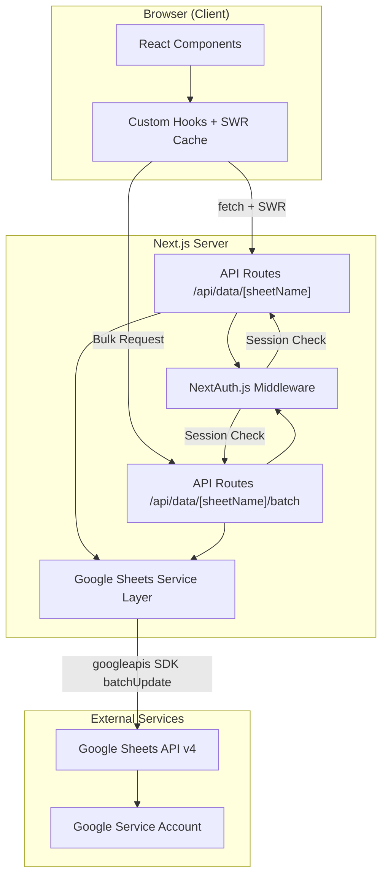
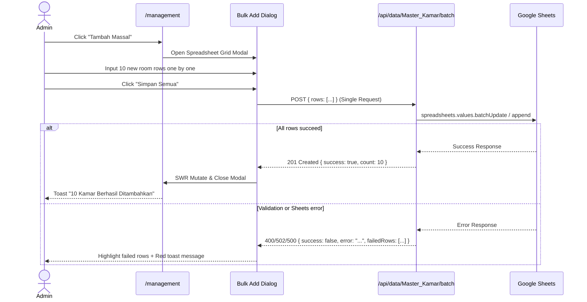
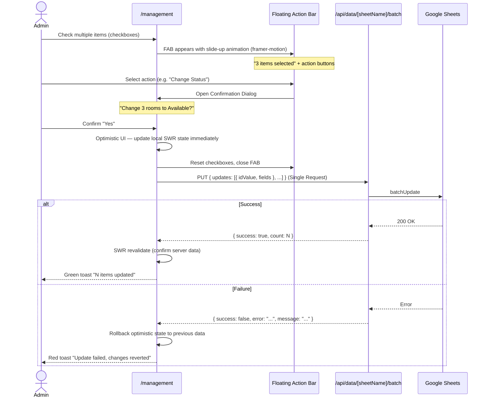

# 📋 PRD — NextKost Management System v2.0

> A **modern web-based digital boarding house management platform** using Google Sheets as a backend database, optimized with UX enhancements for high-efficiency operations.

---

## 1. Product Summary

| Attribute | Detail |
|---|---|
| **Product Name** | NextKost |
| **Version** | 2.0 (UX Enhanced) |
| **Type** | Web Application (SPA-like) |
| **Target Users** | Boarding house owners / managers |
| **UI Language** | Indonesian |
| **Framework** | Next.js 16 (App Router) |
| **Database** | Google Sheets API v4 |
| **Auth** | NextAuth.js v4 (Credentials Provider) |

### Brief Description

NextKost is a boarding house property management system that allows owners to manage all operational aspects — from property registration, room management, tenant data, to rental transactions — through a modern web interface with Google Sheets as the primary data source.

---

## 2. System Architecture



### Data Flow

1. **Client** calls API route `/api/data/{sheetName}` via SWR for standard data, or `/api/data/{sheetName}/batch` for bulk operations.
2. **Middleware** (`next-auth/middleware`) protects all routes except `/login`, `/api/auth/*`, and static assets.
3. **API Route** verifies session via `getServerSession()` before accessing data.
4. **Google Sheets Service** (`lib/google-sheets.ts`) executes CRUD operations to the spreadsheet using a Service Account via single methods or `batchUpdate` to conserve API quota.

---

## 3. Tech Stack

### Core

| Layer | Technology | Version |
|---|---|---|
| Runtime | React | 19.2.4 |
| Framework | Next.js (App Router) | 16.2.6 |
| Language | TypeScript | ^5 |
| Styling | Tailwind CSS | v4 |
| Font | Geist Sans + Geist Mono | (via `next/font`) |

### Data & State

| Library | Purpose |
|---|---|
| `swr` | Client-side data fetching + caching + revalidation |
| `googleapis` | Google Sheets API v4 SDK |
| `google-auth-library` | Service Account authentication |
| `date-fns` | Date manipulation (dynamic due dates per duration unit) |

### UI Components

| Library | Purpose |
|---|---|
| `@radix-ui/*` | Headless UI primitives (Dialog, Select, Tabs, Tooltip, Sheet, HoverCard, Avatar, Label, Badge) |
| `class-variance-authority` | Variant-based component styling |
| `lucide-react` | Icon library (including facility visualization) |
| `framer-motion` | Animations, page transitions, and Floating Action Bar |
| `sonner` | Toast notifications |
| `tailwind-merge` + `clsx` | Utility class merging |

### Auth

| Library | Purpose |
|---|---|
| `next-auth` v4 | Authentication framework (JWT strategy, Credentials Provider) |

---

## 4. Google Sheets Structure (Database Schema)

The application reads and writes to **5 sheets** within a single Google Spreadsheet.

### 4.1 `Master_User`

| Column | Description |
|---|---|
| `Username` | User login ID |
| `Password` | Password (plain text — internal system only, acknowledged as MVP trade-off) |
| `Nama` | User display name |

### 4.2 `Master_Kost`

| Column | Description |
|---|---|
| `ID_Kost` | Primary key (auto-generated slug) |
| `Nama_Kost` | Property name |
| *(additional columns)* | As needed in spreadsheet |

### 4.3 `Master_Kamar`

| Column | Description |
|---|---|
| `ID_Kamar` | Primary key |
| `ID_Kost` | Foreign key → `Master_Kost` |
| `No_Kamar` | Display room number |
| `Lantai` | Floor number |
| *(additional columns)* | As needed in spreadsheet |

### 4.4 `Master_Penghuni`

| Column | Description |
|---|---|
| `ID_Penghuni` | Primary key |
| `ID_Kost` | Foreign key (optional) |
| `Nama` | Tenant name |
| `No_HP` | Phone number (auto-formatted to `62...`) |
| `Bawa_Mobil` | `Ya` / `Tidak` |
| `Kontak_Darurat` | Emergency contact number |

### 4.5 `Transaksi_Sewa`

> **Note:** `Status_Aktif` column has been removed. `Status_Sewa` is now the single source of truth for the full rental lifecycle state.

| Column | Description |
|---|---|
| `ID_Sewa` | Primary key |
| `ID_Kamar` | Foreign key → `Master_Kamar` |
| `ID_Penghuni` | Foreign key → `Master_Penghuni` |
| `Tgl_Masuk` | Rental start date (ISO date) |
| `Tgl_DP` | Down payment date |
| `Nominal_Deposit` | Deposit amount |
| `Periode_Sewa` | Numeric duration value (e.g., 2, 1, 6) |
| `Unit_Durasi` | `Hari` / `Minggu` / `Bulan` |
| `Status_Sewa` | `BOOKING` / `AKTIF` / `SELESAI` — full rental lifecycle state |

---

## 5. Pages & Routing Structure

```
/                          → Home (Property List)
/login                     → Login Page
/[kostId]/dashboard        → Room Layout Dashboard (Enhanced Grid)
/[kostId]/management       → Data Management (Rooms, Tenants, Rentals + Bulk Features)
```

### 5.1 Dashboard — Room Layout (`/[kostId]/dashboard`)

Supports high-density information visualization using a **Mini-Badges** system on each Room Card for rapid data scanning when the "All Floors" filter is active.

#### Room Status Color Codes & Indicators

- 🟢 **Available** (`bg-emerald-500`): Empty room. Badge displays `"Kosong"`.
- 🔵 **Occupied (Active)** (`bg-blue-500`): Actively occupied room. Displays Tenant Name, Duration Badge (`[1 Bulan]`), and Time Remaining Badge (`[Sisa 14 Hari]`).
- 🔴 **Due / Overdue** (`bg-rose-500`): Time remaining ≤ 3 days or already past. Time remaining badge automatically switches contrast (`bg-rose-50 text-rose-700`) with a pulse animation effect when urgent.
- 🟡 **Booking (Reserved)** (`bg-amber-500`): DP paid, tenant not yet moved in. Displays text `"Masuk: DD/MM"`.

#### Micro-Interactions & Information Density

- **Dynamic Facility Icon:** If `Bawa_Mobil` is `Ya`, display a `Car` icon at the top-right corner of the card.
- **Hover Preview (Radix Tooltip):** Displays Phone Number, Check-in Date, Deposit Amount, and Emergency Contact without requiring a click.

### 5.2 Management Page (`/[kostId]/management`)

Provides data management tabs with additional mass productivity features (Bulk Operations).

#### Bulk Add Feature

Interface in the form of a **Spreadsheet-like Grid Modal** (using a structured input table). The owner can fill in dozens of new room or tenant data rows at once and save them in a single click.

#### Bulk Edit Feature

Uses **Checkbox + Floating Action Bar** interaction at the bottom of the screen. When multiple items are checked, the Action Bar appears to execute commands simultaneously (e.g., "Change Selected Status to Available" or "Move Floor").

---

## 6. API Endpoints

The application relies on one dynamic handler for single operations, and one dedicated batch handler for database transaction efficiency.

```
/api/data/[sheetName]
/api/data/[sheetName]/batch
```

| Method | Endpoint | Function | Body / Params |
|---|---|---|---|
| `GET` | `/api/data/[sheetName]` | Read all data from sheet | — |
| `POST` | `/api/data/[sheetName]` | Add a single new row | `{ ...fieldData }` |
| `PUT` | `/api/data/[sheetName]` | Update a single row by ID | `{ idField, idValue, ...fieldData }` |
| `DELETE` | `/api/data/[sheetName]` | Delete a single row by ID | `?idField=X&idValue=Y` |
| `POST` | `/api/data/[sheetName]/batch` | Add multiple rows at once | `{ rows: [[...], [...]] }` |
| `PUT` | `/api/data/[sheetName]/batch` | Update multiple rows at once | `{ updates: [{ idValue, fields }, ...] }` |

### 6.1 Batch API Error Handling

Batch operations follow an **All-or-Nothing (Atomic)** strategy — if any part of the operation fails, the entire batch is rolled back. This prevents partial or inconsistent data states in the sheet.

| Scenario | Server Behavior | Client Behavior |
|---|---|---|
| All rows succeed | `201/200` + `{ success: true, count: N }` | Green toast "N items saved successfully" |
| Validation fails before sending to Sheets | `400` + `{ error: "VALIDATION_ERROR", failedRows: [2, 5] }` | Red toast + highlight problematic rows in grid modal |
| Google Sheets API error (rate limit, etc.) | `502` + `{ error: "SHEETS_ERROR", message: "..." }` | Red toast "Connection failed, please try again" + rollback |
| Partial insert failure (some rows fail in Sheets) | Server manually rolls back (deletes already-inserted rows), returns `500` | Red toast + optimistic UI rollback |

**Standard Batch Response Structure:**

```typescript
// Success
{ success: true, count: 10 }

// Error
{
  success: false,
  error: "VALIDATION_ERROR" | "SHEETS_ERROR" | "PARTIAL_FAIL",
  message: "Human-readable description",
  failedRows?: number[] // indices of problematic rows (for UI highlight)
}
```

---

## 7. Automation Logic & Notifications (Client-Side Smart Logic)

### 7.1 Dynamic Due Date Calculation (`date-fns`)

The system calculates the due date on-the-fly on the client side when rendering the `RoomGrid` component, using a combination of `Tgl_Masuk`, `Periode_Sewa`, and `Unit_Durasi` columns.

**Calculation rules per `Unit_Durasi`:**

| Unit | Method | Rationale |
|---|---|---|
| `Hari` | `addDays(startDate, periode)` | Direct day addition |
| `Minggu` | `addWeeks(startDate, periode)` | Direct week addition |
| `Bulan` | `addDays(startDate, periode × 30)` | Fixed 30-day month for business fairness — tenants always get exactly the same duration regardless of which calendar month they start in |

```typescript
import { addDays, addWeeks } from 'date-fns';

function calculateDueDate(
  startDate: Date,
  periode: number,
  unit: 'Hari' | 'Minggu' | 'Bulan'
): Date {
  switch (unit) {
    case 'Hari':   return addDays(startDate, periode);
    case 'Minggu': return addWeeks(startDate, periode);
    case 'Bulan':  return addDays(startDate, periode * 30);
  }
}
```

### 7.2 WhatsApp Reminder Integration (WhatsApp URL Intent)

In the Tenant Side-Panel, the system provides a **"Remind via WA"** button for rooms with urgent/due status. This button auto-constructs the URL with no third-party API cost:

```
https://wa.me/{No_HP}?text=Halo%20[Nama],%20mengingatkan%20sewa%20kamar%20[No_Kamar]%20akan%20berakhir%20pada%20[Tgl_Jatuh_Tempo].%20Terima%20kasih!
```

---

## 8. Key User Flows

### 8.1 Bulk Add New Rooms



### 8.2 Bulk Edit via Floating Action Bar



---

## 9. Technical Constraints & Considerations

| Aspect | Detail |
|---|---|
| **Google API Rate Limit** | Google Sheets API v4 limit is 300 requests per minute per project. `batch` operations minimize the risk of request rejection (Error 429). |
| **Optimistic UI Update** | Since Google Sheets responses take ~1-2 seconds, the UI must perform local state mutation (SWR Optimistic Update) first so that card color transitions feel instant to the user. On API failure, state is rolled back immediately with a toast notification. |
| **Atomic Batch Strategy** | All batch operations are all-or-nothing. Partial failures trigger a server-side rollback before returning an error, ensuring the sheet never ends up in a half-written state. |
| **Plain Text Password** | `Master_User` stores passwords as plain text. This is an acknowledged trade-off for an internal-only single-user system at MVP stage. |
